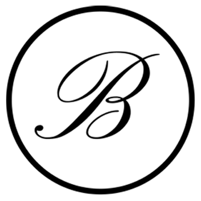

# Bebek Resort Hotel

## About

Bebek is one of Istanbul's wealthiest and most popular neighborhoods.

It's home to a plethora of chic cafes, restaurants, and shops. Its coastline, stretching from Arnavutköy to Rumeli Hisarı, offers some of Istanbul's most spectacular views.

The "Bebek" neighborhood is being reborn in Kozlu village, in the Assos region!

At the foot of the Kaz Mountains, with its elevated elevation and sea views of Lesbos Island, the upcycling-themed Bebek Resort, located in the center of Kozlu village, is as small as a baby. It's only 97.5 square meters!

This tiny space is worth a visit, as it will make you wonder if you're in a neighborhood, a hotel, a café or a bistro, a museum or a parking lot, a cruise ship or a caravan, or in the past or the present!

A stonemason used stones (Assos stone) from a ruined stone house to build a perimeter wall. Two scrap minibuses, previously decommissioned, were repurposed as sleeping units. The toilet and bathroom in the captain's cabin of a Norwegian cruise ship were redesigned. Old telephone poles were used in the roof. A stainless steel industrial refrigerator was repurposed as a laundry room. A secondhand mannequin representing a uniformed naval officer was placed in memory of the Gallipoli Campaign of World War I.

Bebek Resort demands attention, a place for little ones and a charming journey through time for adults.

## Upcycling

### What is Upcycling?

Upcycling is the process of transforming old and unused products or materials into more valuable and functional items. This process often requires a creative and artistic approach. For example, creating a stylish lamp from an old wine bottle or a new bag from a pair of old jeans are examples of upcycling. In this process, old products are often given a new life with a higher value and sometimes take on a completely different function. Upcycling not only minimizes waste but also benefits the environment by introducing new ideas in design and aesthetics.

### Advantages of Upcycling

Reducing Environmental Impact: Reduces waste because old materials are reused.
Stimulates Creativity: Opens up a diverse and creative avenue for designers and artists.
Economic Benefits: Old products or materials can be transformed into high-quality, unique products, generating additional income.

---

## Adresses

Bebek Resort
Kozlu Köyü, Ayvacık
17862 Çanakkale, Türkiye

## Contact
info@bebekresort.com.tr

## Logo Pack

